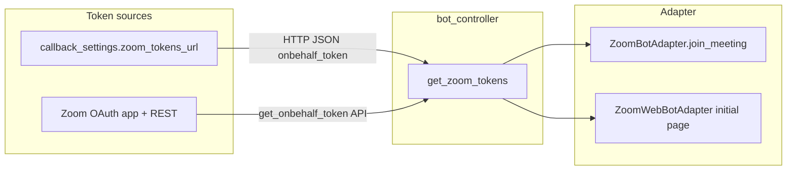

# Zoom Meet Bot：On Behalf Of Token 与代码对照

## 1. 结论（是否带 “on behalf secret or token”）

| 项目 | 说明 |
|------|------|
| **入会是否携带 OBF** | **是（可选）**：当 `zoom_tokens` 中存在非空的 `onbehalf_token` 时，原生 SDK 与 Web 适配器都会把它传给 Zoom。 |
| **“on behalf secret”** | **代码中无此概念**。与 OBF 相关的是 **token**（REST 返回的 `token` 字段），不是名为 secret 的 Join 参数。 |
| **OAuth client_secret** | 存储在 [ZoomOAuthApp](bots/models.py) 凭据中，用于 OAuth 应用身份；**不**作为 `JoinParam` 的 “on behalf” 字段传入会议。 |
| **Meeting SDK JWT** | [generate_jwt](bots/zoom_bot_adapter/zoom_bot_adapter.py) 使用 `client_id` + `client_secret` 生成 **SDK 会话 JWT**（`HS256`），这是 SDK 初始化/鉴权用，与 OBF **并列**，不是 OBF 本身。 |

## 2. 代码路径（从取 token 到 Join）

- **入口**：[`BotController.get_zoom_tokens`](bots/bot_controller/bot_controller.py) — 若配置了 `zoom_tokens_url` 则走回调；否则 [`get_zoom_tokens_via_zoom_oauth_app`](bots/zoom_oauth_connections_utils.py)。
- **OAuth 获取 OBF**：[`_get_onbehalf_token`](bots/zoom_oauth_connections_utils.py) 调用  
  `GET https://api.zoom.us/v2/users/me/token?type=onbehalf&meeting_id={meeting_id}`，请求头 `Authorization: Bearer {access_token}`，响应中取 `token`。
- **谁的用户**：[`get_onbehalf_token_via_zoom_oauth_app`](bots/zoom_oauth_connections_utils.py) 根据 `bot.settings.zoom_settings.onbehalf_token.zoom_oauth_connection_user_id` 解析对应的 `ZoomOAuthConnection`，且要求 [`is_onbehalf_token_supported`](bots/models.py) 为真。
- **原生 SDK 入会**：[`ZoomBotAdapter.join_meeting`](bots/zoom_bot_adapter/zoom_bot_adapter.py) 在存在 `onbehalf_token` 时设置 `param.onBehalfToken`；并对 `MEETING_FAIL_AUTHORIZED_USER_NOT_INMEETING` + OBF 场景做重试逻辑。
- **Web 入会**：[`zoom_web_bot_adapter.py`](bots/zoom_web_bot_adapter/zoom_web_bot_adapter.py) 将 `onbehalf_token` 注入页面；[`zoom_web_chromedriver_page.js`](bots/zoom_web_bot_adapter/zoom_web_chromedriver_page.js) 使用 `obfToken` / `onBehalfToken`。

## 3. 与 Zoom 公开文档的对应关系（调研摘要）

- Zoom Meeting SDK 授权说明：[Meeting SDK authorization](https://developers.zoom.us/docs/meeting-sdk/auth/) — 外部会议需 **ZAK** 或 **OBF** 等（与仅 JWT 场景区分）。
- OBF 过渡政策：[Transitioning to On Behalf Of (OBF) tokens](https://developers.zoom.us/blog/transition-to-obf-token-meetingsdk-apps/) — 外部账户会议对 Meeting SDK 应用的约束；OBF 需合适 scope，且通常要求关联用户已在会中（与本项目重试/超时行为一致）。
- 本项目 REST 路径与文档一致：`type=onbehalf` + `meeting_id`，用用户 OAuth `access_token` 换 **OBF token**，再交给 SDK `onBehalfToken` / Web 侧同等字段。

## 4. 在本项目中如何“应用”（启用 OBF）

1. **Zoom 开发者控制台**：创建 OAuth App，勾选文档要求的 scope（仓库说明见 [docs/zoom_oauth.md](docs/zoom_oauth.md)，含 `user:read:token` 等与 onbehalf 相关项）。
2. **Attendee 侧数据**：创建/更新 `ZoomOAuthConnection`，将 `is_onbehalf_token_supported` 设为支持；用户完成 OAuth 授权。
3. **启动 bot 时在 settings 中指定**（与 [docs/zoom_oauth.md](docs/zoom_oauth.md) 一致）：  
   `zoom_settings.onbehalf_token.zoom_oauth_connection_user_id` = 该用户对应的 OAuth connection user id。
4. **若不使用内置 OAuth，而自建 token**：配置 `callback_settings.zoom_tokens_url`，响应 JSON 可提供 `onbehalf_token`（见 [bots/external_callback_utils.py](bots/external_callback_utils.py) 与 [docs/openapi.yml](docs/openapi.yml) 描述）。

## 5. 可选后续（非必须）

- 若需 **仅** 验证运行时是否带上 OBF：在测试环境对 `get_zoom_tokens_via_zoom_oauth_app` / 回调返回值打日志（注意脱敏），或沿用 [bots/tests/test_zoom_bot.py](bots/tests/test_zoom_bot.py) 中 `onBehalfToken` 断言用例。
