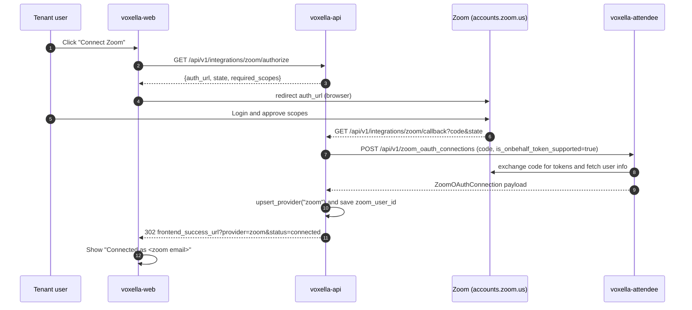
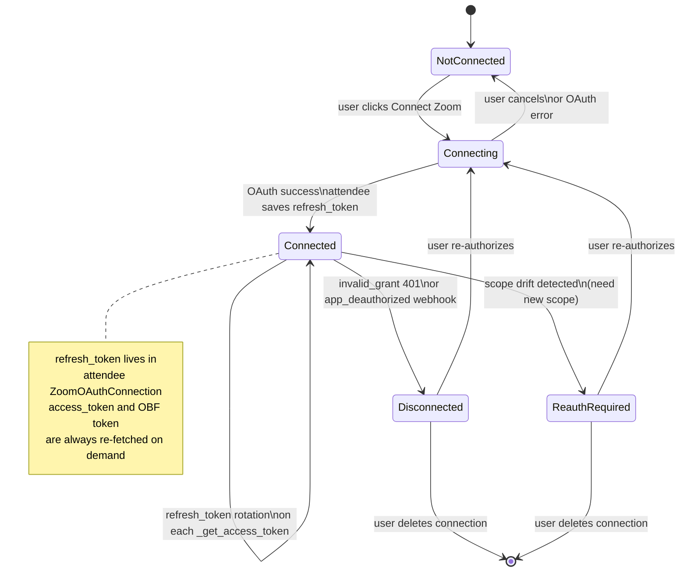

# Zoom 录制路径优化计划（RTMS 优先 + OBF 兜底）

## 一、目标与总体策略

- 主路径 **RTMS**（App Session）：录制/转写/AI 纪要的默认通道，无 bot 参会、成本低、带 speaker 维度的数据、不受 2026-03-02 OBF 强制期影响。
- 兜底路径 **OBF SDK bot**：当 host 组织未启用 RTMS、用户未安装你的 RTMS App、或需要"会内交互/可见参会者"时使用。
- 特殊路径 **ZAK + SDK**：仅用于你家 Zoom 账户主办的会议。
- 多租户 key：每次入会用 per-bot 的 `zoom_settings.onbehalf_token.zoom_oauth_connection_user_id` 绑定"代谁"。

```mermaid
flowchart TD
  A[voxella-api receives tenant request] --> R{routeMeeting}
  R -->|host org has RTMS app installed\nor auto-start enabled| RTMS[RTMS App Session]
  R -->|need in-meeting UI\nor RTMS unavailable| OBF[OBF SDK Bot]
  R -->|our tenant is host| ZAK[ZAK plus SDK]
  RTMS -.|meeting.rtms_started webhook| Attendee
  OBF -.|create bot with onbehalf_user_id| Attendee
```

---

## 二、voxella-attendee 侧改造

### 1. 默认打开 OBF 能力位（必要变更，需受控上线）
- 现状：[bots/serializers.py](bots/serializers.py) L2362 `is_onbehalf_token_supported` 默认 `False`；[bots/models.py](bots/models.py) L227 同默认。
- 保留 DB 默认 `False`（兼容历史数据），但在 `CreateZoomOAuthConnectionSerializer` 中：
  - 将 `is_onbehalf_token_supported` 的**序列化默认改为 `True`**，以满足 Zoom 2026-03-02 之后外部会议场景对 OBF 的要求；
  - 保留"two-both-false"互斥校验；
  - 在 scope 校验失败时返回更明确的错误码（区分 scope 缺失与 Zoom API 错误）。
- 这是一个**公共 API 默认值变更**，不是纯内部实现细节；因此落地时需要同时做：
  - 审核并同步所有创建 `ZoomOAuthConnection` 的调用方，确保它们要么显式传 `is_onbehalf_token_supported`，要么已经具备 `user:read:token` scope；
  - 对仅需 local recording token 的旧调用方，允许显式传 `is_onbehalf_token_supported=false` 继续工作；
  - 发布说明里明确这一行为变更，避免第三方集成在升级后因 scope 不足而失败。
- 存量 connection 升级不要依赖 [bots/internal_views.py](bots/internal_views.py) 的 runtime snapshot 输出；应提供一个明确的管理入口或一次性脚本，对确认具备 scope 的 connection 批量补齐 `is_onbehalf_token_supported=true`。

### 2. OBF 稳定性增强
- 在 [bots/zoom_oauth_connections_utils.py](bots/zoom_oauth_connections_utils.py) 的 `get_onbehalf_token_via_zoom_oauth_app` 中：
  - 当某用户 `is_onbehalf_token_supported=False` 时，返回结构化告警（上报事件），而不是静默 `return None`，便于 voxella-api 回退决策。
  - 给 `_get_onbehalf_token` 加一次轻量 cache（同一 bot 生命周期内），避免重试逻辑多次换 token。
- 在 [bots/zoom_bot_adapter/zoom_bot_adapter.py](bots/zoom_bot_adapter/zoom_bot_adapter.py) L1154 `handle_failed_to_join_because_onbehalf_token_user_not_in_meeting`：
  - 把 `ZOOM_ONBEHALF_TOKEN_RETRY_TIME_SECONDS` 最小值保护到 >= 30s（避免刷 host 邮件通知，社区常见坑）；
  - 每次重试消息里加入 `authorized_user_id`，方便多租户排障。

### 3. 路由与诊断信号
- 新增一个内部 API（或复用 `internal_views`）：  
  `GET /internal/zoom/routing_hint?project_id=&host_user_id=&meeting_id=` 返回建议路径 `{"path": "rtms|obf|zak", "reason": "..."}`，供 voxella-api 决策（见下）。
- 决策依据：是否有匹配 `ZoomOAuthApp`、是否存在 `ZoomOAuthConnection` 且 `is_onbehalf_token_supported`、`ZoomMeetingToZoomOAuthConnectionMapping` 是否命中该 meeting（判断 host 是否在你家）。

### 4. App Session（RTMS）打磨
- 现有链路已完善（[bots/zoom_rtms_adapter/zoom_rtms_adapter.py](bots/zoom_rtms_adapter/zoom_rtms_adapter.py) L361–L621 订阅 active speaker / join / leave / transcript），无需大改。建议：
  - `transcriptUpdate` 事件中补字段 `end_timestamp`（若 Zoom payload 带，直接透传；否则用下一条相同 user 的 `timestamp` 推导），对齐"speaker + time range"诉求。
  - `GET /api/v1/app_sessions/{id}/participant_events` 当前语义仍是 participant events；若要补 `speaking_segments`，更稳妥的是新增字段并保持向后兼容，或提供单独读取接口，避免改变现有返回契约。
- 并发：当同一 meeting 既进了 RTMS App Session 又进了 OBF Bot（灰度/对比期），不能只依赖 `deduplication_key` 避免重复计费与重复回调；还需要在 voxella-api 增加“单飞锁 + 幂等创建键 + 迟到 RTMS webhook 忽略/终止策略”，防止两个采集实例同时跑起来。

### 5. 观测
- Metrics 计数：`zoom_join_path{path=rtms|obf|zak}`、`obf_retry_total`、`authorized_user_not_in_meeting_total`。
- 日志脱敏：所有 OBF token 仅记录长度/hash，禁止完整落地。

---

## 三、用户 Zoom 授权流程（跨 web + api + attendee，**先决条件**）

没有用户 OAuth 授权，就拿不到 `access_token` → 拿不到 OBF；Zoom App 上的 scope 配置只是"允许申请"，并不等于"已授权"。必须每一位需要"代表他入会"的租户用户完成一次 OAuth，生成 `ZoomOAuthConnection`。



### 3.1 voxella-web（新增 UI 入口）

- 新增"Integrations / Connect Zoom"卡片，组件位置建议放到账户/设置相关页（复用 `OAuthCallback.tsx` 已有 pattern），关键流程：
  1. 按钮调 `GET /api/v1/integrations/zoom/authorize` 拿到 `auth_url` + `required_scopes`；
  2. `window.location.href = auth_url`（不走 SPA 前端，状态保存在 server Redis 中，**不要**再往 `sessionStorage` 放 state）；
  3. Zoom 成功后 voxella-api 已经 302 回 `frontend_success_url?provider=zoom&status=connected`，web 侧读 query 显示结果；失败时读 `?reason=invalid_state|redirect_mismatch|attendee_error|persist_failed`。
- 在创建会议 bot 的表单里：必须先展示当前用户的 Zoom 连接状态；若未连接则禁用"OBF 路径"，并 CTA 引导去连接。
- i18n：`zh-CN / en / ...` 的 "connect_zoom / disconnect_zoom / reauth_required" 文案补齐。

### 3.2 voxella-api（补足，不是从零）

现状：[app/routers/zoom.py](../voxella-api/app/routers/zoom.py) 已有 `authorize` / `callback` / `webhook`；[app/services/zoom_oauth.py](../voxella-api/app/services/zoom_oauth.py) 已实现 state（Redis）、create_attendee_zoom_oauth_connection（带 `is_onbehalf_token_supported=true`）、webhook 签名校验与转发。需要补：

- **RTMS 事件订阅**：[app/services/zoom_oauth.py](../voxella-api/app/services/zoom_oauth.py) L17 的  
  `ZOOM_WEBHOOK_EVENT_TYPES = frozenset({"meeting.created", "user.updated"})`  
  扩展为包含 `meeting.rtms_started` / `meeting.rtms_stopped`。  
  同时在 router 里针对这两个事件**不走 `forward_zoom_webhook_to_attendee`（它指向 oauth_apps 端点）**，改走 `POST /api/v1/app_sessions`（见 [docs/zoom_rtms.md](docs/zoom_rtms.md)），并带上 `metadata={voxella_user_id, tenant_id}`。
- **连接状态查询 API**：`GET /api/v1/integrations/zoom/connection` → 返回当前用户 `{connected, zoom_user_id, zoom_account_id, is_onbehalf_token_supported, attendee_state}`，供 web 展示与路由决策。
- **撤权 / 断连**：`DELETE /api/v1/integrations/zoom/connection` → 调用 attendee `DELETE /api/v1/zoom_oauth_connections/{id}` 并清 `user.providers.zoom`。
- **接收 Attendee 的 `zoom_oauth_connection.state_change`**：新增 `POST /attendee/webhook/zoom_state_change`，必须按 webhook payload 里的**目标状态**消费，而不是“收到事件就标坏”：
  - `connected`：清除 `reauth_required`，恢复正常；
  - `disconnected`：标记 `reauth_required` 并提示重连。
- **scope 列表**：OBF 用户 OAuth scope 维持 `user:read:user`、`meeting:read:list_meetings`、`meeting:read:local_recording_token`、`user:read:zak`、`user:read:token`。RTMS 五个 scope 属于 Zoom Marketplace RTMS App 的配置与审核范围，不进入用户 OBF OAuth 的 scope drift 判断。
- **多 Zoom App（dev/prod）区分**：`settings.attendee.zoom_oauth_app_id` 已在用，保留；RTMS 如另建 App 则需要第二个 `zoom_rtms_app_id` 配置项。

### 3.3 voxella-attendee（已有能力，确认即可）

- [bots/zoom_oauth_connections_api_utils.py](bots/zoom_oauth_connections_api_utils.py) 已经按 `is_onbehalf_token_supported` 做 scope 校验（L86–L95）。
- OAuth 授权后产出的 `ZoomOAuthConnection.user_id` 就是后续 create bot 时要带的 `zoom_settings.onbehalf_token.zoom_oauth_connection_user_id`（attendee 侧同名字段）。
- 如无变化，这一节不需要改代码；但建议加一条健康检查：`GET /internal/zoom/connection/{user_id}/health` 返回 "是否能成功 refresh + 是否有 onbehalf scope"。

### 3.4 授权持久化（一次授权，长期可用）

**每位用户只需授权一次**，前提是 refresh_token 链条不断：

| 数据 | 存储位置 | 细节 |
|---|---|---|
| `refresh_token` | voxella-attendee `ZoomOAuthConnection._encrypted_data`（[bots/models.py](bots/models.py) L221–L241） | Fernet 对称加密的 `BinaryField`；`set_credentials` / `get_credentials` 读写 |
| `access_token` | 不存（即用即抛） | [zoom_oauth_connections_utils.py](bots/zoom_oauth_connections_utils.py) `_get_access_token` L138–L182 用 refresh_token 换；Zoom 返回新 refresh_token 时 L172–L176 自动覆盖持久化 |
| OBF token | **不缓存** | 入会前实时 `GET users/me/token?type=onbehalf&meeting_id=...` 生成 |
| 元数据 | voxella-api `user.providers.zoom`（[app/routers/zoom.py](../voxella-api/app/routers/zoom.py) L122–L140） | `attendee_zoom_oauth_connection_id`、`zoom_user_id`、`zoom_account_id`、`attendee_state` 等索引字段；voxella-api **不存** refresh_token |

会触发"需要重新授权"的场景：

- 用户在 Zoom Marketplace 卸载 App（Zoom 推 `app_deauthorized` webhook → attendee 标记 `DISCONNECTED` → 触发 `zoom_oauth_connection.state_change`）
- 用户 Zoom 账号被停用/删除，或管理员撤销授权
- 你**新增 OBF 用户 OAuth scope**（而不是 RTMS App scope）→ 必须让用户重新走 OAuth 同意新权限
- attendee 侧 Fernet 加密密钥轮换未正确迁移（运维层面 guard）

连接状态机（端到端）：



状态迁移信号：

- `Connecting -> Connected`: voxella-api `/callback` 成功写入 provider metadata（`attendee_state=connected`）。
- `Connected -> Disconnected`: attendee `_handle_zoom_api_authentication_error` 把 `state` 置 `DISCONNECTED`，`trigger_webhook(zoom_oauth_connection.state_change)` 通知 voxella-api。
- `Connected -> ReauthRequired`: voxella-api 发现 connection 现存 **OBF 用户 OAuth** scope 缺少新需 scope。
- `Disconnected/ReauthRequired -> Connecting`: web 端 CTA 再次打 `/authorize`。

对应实现要点（补到下面 todos）：

- voxella-api 持久化时**只写 metadata**，绝不复制 refresh_token；当前实现已符合此原则。
- 加密密钥：attendee 侧的 Fernet key 放 `settings`/secret 存储，禁止随代码/容器镜像打包；密钥轮换需提供迁移脚本（读旧 key 解密、写新 key 加密）。
- scope drift：voxella-api [app/services/zoom_oauth.py](../voxella-api/app/services/zoom_oauth.py) 的 `ZOOM_REQUIRED_SCOPES` 若改动，要同时：
  1. Zoom Marketplace App 侧添加 scope 并重新提审；
  2. 在 voxella-api 侧比较 connection 已有 scope（attendee 可扩展返回），发现 missing 时把 provider 标 `reauth_required`；
  3. web 侧展示"Zoom 连接已过期，需要重新授权以启用 X 功能"的 CTA。
- 提供简单自检：`_get_access_token` 失败（401/invalid_grant）就走 `_handle_zoom_api_authentication_error`（[zoom_oauth_connections_utils.py](bots/zoom_oauth_connections_utils.py)）→ 置 `DISCONNECTED` → 触发 `state_change` webhook → voxella-api 置 `reauth_required`。同时要处理 attendee 后续重新验证成功并回到 `CONNECTED` 的 webhook，把 provider 状态一并恢复。

### 3.5 关键约束（一定要在 UI 提示给用户）

- 只有**完成 OAuth 并授予 `user:read:token` scope**的用户，才能作为 OBF 的 "authorized user"。
- OBF 要求该用户**在会议中**才能让 bot 入会；否则触发 `AUTHORIZED_USER_NOT_INMEETING` 重试（见计划二-2）。
- 用户在 Zoom 后台卸载你的 App → attendee 发 `zoom_oauth_connection.state_change` → web 需引导重新授权；此时若该用户有 bot 在跑，OBF 会直接失败。

---

## 四、voxella-api 路径路由改造（原"三"，接在授权之后）

### 1. 路径路由（核心）
在创建录制任务入口新增 `selectZoomPath(meetingCtx)`：
- 输入：`meeting_url`、租户 user 的 Zoom user id、该租户 Zoom 账号是否为 host、host 组织 RTMS 启用状态（通过我们保存的 host `ZoomOAuthConnection` 或 RTMS app 订阅状态推断）。
- 输出：
  - `rtms` → 等待/依赖 `meeting.rtms_started` webhook，转发给 Attendee `POST /api/v1/app_sessions`；
  - `obf` → 直接 `POST /api/v1/bots`，带 `zoom_settings.onbehalf_token.zoom_oauth_connection_user_id`；
  - `zak` → 走 `callback_settings.zoom_tokens_url` 或直接内置 OAuth app 分支。
- 策略顺序：优先级建议改为 `RTMS (if host enabled) > ZAK (self host) > OBF (tenant user in meeting)`。理由是 ZAK 是“我方主办会议”的强确定性路径，不依赖“授权用户已入会”这一弱前提，应该排在 OBF 之前。
- 无论走哪条路径，都要写入同一个 routing attempt 记录，包含 `meeting_key`、选路理由、幂等键、当前 owner；后续 fallback 必须基于这条记录做 CAS 更新，避免并发双启动。

### 2. "代谁参会" 的租户映射
- 为每个租户维护 `tenant_user_id -> zoom_user_id` 映射表；启动录制前必须能解析出至少一个**确实会在会议中**的 Zoom user id（主持人优先，其次日历解析到的我方与会人）。
- 若无可靠候选，返回 409/"unattended meeting"，并允许用户一键跳到 RTMS 授权流程。

### 3. RTMS Webhook 桥接
- Zoom `meeting.rtms_started` webhook → voxella-api 的新端点 `/zoom/rtms/started` → 直接调用 Attendee `POST /api/v1/app_sessions`，携带 `zoom_rtms` 原 payload + 租户 `metadata`。
- `meeting.rtms_stopped` 用于兜底清理/回调。
- Attendee 侧 `bot.state_change`（已有）→ `ended` 时拉取 transcript/media（对应 [docs/zoom_rtms.md](docs/zoom_rtms.md) 末尾段）。
- 为避免 RTMS 晚到导致又创建第二条采集链路，`meeting.rtms_started` 到达时必须先检查 routing attempt：
  - 若当前 owner 仍是 `rtms_pending`，则原子切换到 `rtms_active` 并创建 app session；
  - 若已经切到 `obf_active`/`zak_active`，则只记录“late RTMS webhook”事件，不再创建新 session。

### 4. OAuth 流程与撤权处理
- 用户首次接入时统一要的是 **OBF 用户 OAuth** scope：`user:read:user`、`user:read:token`，以及现有实现需要的 `meeting:read:list_meetings`、`meeting:read:local_recording_token`、`user:read:zak`。RTMS 五个 scope 属于 Zoom RTMS App 配置，不经由这个用户 OAuth 流程申请。
- 订阅 Attendee 的 `zoom_oauth_connection.state_change` webhook，并按 payload state 做双向同步：`disconnected -> reauth_required`，`connected -> connected`。不要把该事件当成“仅断连通知”。

---

## 五、Zoom Marketplace 配置清单（运维侧）

- **两个 App（或一个合并 App，取决于发布策略）**：
  - Meeting SDK + OAuth（OBF 所需）：scope `user:read:user`、`user:read:token`；Embed → Meeting SDK ON。
  - RTMS App：event subscription 勾选 `meeting.rtms_started` / `meeting.rtms_stopped`；scope 勾选 RTMS 五项。
- 在 Zoom 个人设置里启用 "share realtime meeting content with apps"，并把我们的 RTMS app 设为 auto-start（详见 [docs/zoom_rtms.md](docs/zoom_rtms.md) L49–L54）。
- Marketplace 审核：SDK bot 参与外部会议需过审（2026-03-02 截止的合规要求）。

---

## 六、灰度与验证策略

1. 先上 RTMS 主路径：对已授权 RTMS 的租户切 100%，其余维持旧 OBF 路径。
2. 对 OBF 路径：先把 `ZOOM_ONBEHALF_TOKEN_RETRY_TIME_SECONDS` 调整到 >= 30s 观察一周，确认 host 邮件告警显著下降。
3. 同会议双跑对比（受限灰度）：选若干允许账号同时开 RTMS 与 OBF，校对 transcript/speaker 片段一致性后，再把 OBF 降级为纯兜底。
4. 失败 fallback 闭环：当 RTMS 15s 内未收到 `meeting.rtms_started` 且会议确已开始，voxella-api 才尝试 fallback；fallback 前必须先抢占 routing attempt owner，抢占成功后才能下发 OBF/ZAK，避免双启动。
5. 增加一次升级前演练：枚举当前所有 `ZoomOAuthConnection` 创建入口与调用方，确认默认值改 `true` 后的 scope 覆盖率；未满足的调用方要么先补 scope，要么显式传 `false`。

---

## 七、不做的事（本轮）

- 不重写原生 `zoom_bot_adapter` 的底层加入流程。
- 不改动 RTMS 媒体处理管线（`rtms_gstreamer_pipeline.py`）。
- 不引入新的 OAuth 存储方案，沿用现有 `ZoomOAuthApp` / `ZoomOAuthConnection`。
