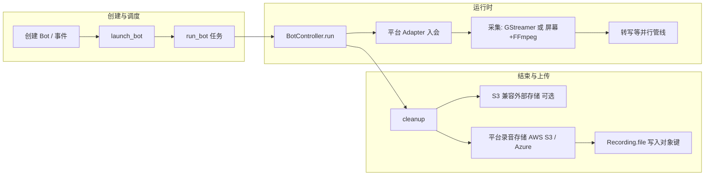

# Bot 加入会议、录制音视频与上传到指定位置的流程

本文档描述本仓库中 **会议 Bot 从创建/拉起、入会、录制到落盘上传** 的主干链路，便于对接集成与排查问题。实现以 `BotController` 为中心，具体行为随会议平台（Zoom / Google Meet / Teams）与部署方式（Celery / Kubernetes / Docker 多机等）略有差异。

## 1. 总览（Pipeline / Workflow）

**要点：**

- **主录制文件**：先写在 Worker 本地（默认 `/tmp`，可配置为持久卷路径）。
- **结束上传顺序**（见 `BotController.cleanup`）：若启用 **外部媒体存储**，先上传到用户指定的 S3 兼容桶；再上传到 Attendee **内置录音存储**（`STORAGE_PROTOCOL` 为 Azure 时用 Azure，否则 S3）；最后把对象键写入默认 `Recording` 的 `file` 字段并删除本地临时文件。

## 2. 创建 Bot 与拉起 Worker

### 2.1 典型入口

- **HTTP API**：通过序列化器创建 Bot（含 `meeting_url`、`settings` 等），校验通过后由业务侧触发 `launch_bot(bot)`。
- **管理命令**：例如 `launch_bot` 会创建 `Bot`、`Recording`，并发出 `JOIN_REQUESTED` 事件后调用 `run_bot`。

### 2.2 `launch_bot` 与环境变量

`bots/launch_bot_utils.py` 根据 `LAUNCH_BOT_METHOD` 决定如何执行 `BotController`：

| `LAUNCH_BOT_METHOD` | 行为 |
|---------------------|------|
| （默认，未设置） | `run_bot.delay(bot.id)` — Celery 任务 |
| `kubernetes` | 创建 K8s Pod 运行 Bot |
| `docker-compose-multi-host` | `run_bot_in_ephemeral_container` 发到 `bot_launcher_vm` 队列 |
| `modal` | `modal.Function.spawn(...)` 远程拉起 Bot |

Celery 任务 `run_bot`（`bots/tasks/run_bot_task.py`）实质为：`BotController(bot_id).run()`。

## 3. BotController：管线配置与入会

### 3.1 `PipelineConfiguration`

`get_pipeline_configuration()` 根据 Bot 的 **录制格式**、是否 **RTMP**、是否 **WebSocket 推音频** 等，构造合法的 `PipelineConfiguration`（见 `bots/bot_controller/pipeline_configuration.py`）。非法组合会在构造时抛错。

录制类型由 `recording_settings.format` 推导（见 `Bot.recording_type()`）：

- `MP4` / `WEBM` → 音视频录制
- `MP3` → 仅音频
- `NONE` → 不落盘录制（仍可纯转写等）

### 3.2 选择平台 Adapter

`get_adapter()` 按 `meeting_url` 解析出的会议类型挂载：

- **Zoom**：native SDK、Zoom Web 或 RTMS（GStreamer）分支
- **Google Meet**：Web 自动化 + 浏览器侧画面
- **Teams**：Web 自动化

各 Adapter 负责 **加入会议、采集媒体、回调到 Controller**（如混音块、字幕、离会等）。

### 3.3 录制落盘的两种技术路径

| 场景 | 是否创建 GStreamer | 是否创建 ScreenAndAudioRecorder |
|------|---------------------|----------------------------------|
| Zoom（非 Web、且需录制/RTMP 等） | 通常 **是** | **否** |
| Google Meet / Teams | **否**（浏览器承担画面） | **是**（FFmpeg：X11 + ALSA 或仅 ALSA） |

- **Meet/Teams**：`ScreenAndAudioRecorder` 在虚拟显示上抓取画面与系统音频，写入 `get_recording_file_location()` 指向的路径。
- **Zoom（GStreamer）**：编码输出写入同一逻辑上的「录制文件路径」（格式随 `recording_format` 映射为 WebM/MP3/MP4 等）。

**录制目录**：`get_recording_storage_directory()` — 默认 `/tmp`；若 `recording_settings.reserve_additional_storage` 为真，则使用 `/bot-persistent-storage`（与 K8s 持久卷等配合）。

**无本地录制文件的情况**：纯 RTMP 推流或纯转写无落盘时，`get_recording_file_location()` 为 `None`，cleanup 中不会走文件上传分支。

## 4. 会议结束与 `cleanup`

离会或异常路径会调用 `cleanup()`，顺序大致为：

1. 停止 GStreamer / RTMP / Adapter / 屏幕录制器等，必要时对录像做 seekable 等后处理（`ScreenAndAudioRecorder.cleanup`）。
2. **若存在本地录制文件**：
   - `upload_recording_to_external_media_storage_if_enabled()`（可选）
   - `get_file_uploader()` 上传到 **平台内置存储**
   - `wait_for_upload` → 删除本地文件 → `recording_file_saved(uploader.filename)` 更新数据库

### 4.1 「指定位置」——外部 S3 兼容存储

在 Bot `settings` 中配置 `external_media_storage_settings`（JSON Schema 见 `bots/serializers.py`）：

- **必填**：`bucket_name`
- **可选**：`recording_file_name`（不填则使用默认命名 `{bot_object_id}-{recording_object_id}.{extension}`）

**凭证**：项目下需存在 `Credentials.CredentialTypes.EXTERNAL_MEDIA_STORAGE`，字段包括 `access_key_id`、`access_key_secret`、`region_name`，以及可选的 `endpoint_url`（兼容 S3 API 的对象存储）。创建 Bot 时若填写外部存储设置，API 会校验项目是否已配置对应凭证（`validate_external_media_storage_settings`）。

上传实现：`S3FileUploader`（boto3），与内置存储可在同一次 cleanup 中各上传一次。

### 4.2 平台内置录音存储

- **Azure**：`AzureFileUploader` + `AZURE_RECORDING_STORAGE_CONTAINER_NAME` 等
- **AWS S3**：`S3FileUploader` + `AWS_RECORDING_STORAGE_BUCKET_NAME` 等

上传完成后，`recording_file_saved` 将 **`Recording.file`** 设为存储中的对象键/路径，并写入 `first_buffer_timestamp_ms` 等与时间对齐有关的字段。

## 5. 并行管线：转写与 POST_PROCESSING

录制进行中，音频流会进入转写管线（如 Deepgram 等）；会议进入 **POST_PROCESSING** 状态时，`cleanup` 末尾会等待 utterance 结束或超时，再触发 `POST_PROCESSING_COMPLETED` 事件。这与「文件已上传」是不同维度：**文件上传在 cleanup 前半段完成**，转写可能在稍后结束。

## 6. 配置速查（与录制/上传相关）

| 配置项 | 作用 |
|--------|------|
| `settings.recording_settings.format` | MP4 / WEBM / MP3 / NONE，决定管线类型与容器格式 |
| `settings.recording_settings.resolution` / `view` | 录制分辨率、视图（如演讲者布局） |
| `settings.recording_settings.reserve_additional_storage` | 是否使用 `/bot-persistent-storage` |
| `settings.external_media_storage_settings` | 外部桶名与可选对象名 |
| 项目 Credentials `EXTERNAL_MEDIA_STORAGE` | 外部存储访问密钥与 endpoint |
| `LAUNCH_BOT_METHOD` | Celery / K8s / Docker 多机 / Modal 拉起方式 |
| `STORAGE_PROTOCOL` | 内置录音走 S3 还是 Azure |

## 7. 相关代码索引

- 编排与上传：`bots/bot_controller/bot_controller.py`（`cleanup`、`get_file_uploader`、`upload_recording_to_external_media_storage_if_enabled`）
- 屏幕+音频录制：`bots/bot_controller/screen_and_audio_recorder.py`
- 管线合法组合：`bots/bot_controller/pipeline_configuration.py`
- Celery 入口：`bots/tasks/run_bot_task.py`
- 拉起方式：`bots/launch_bot_utils.py`
- 外部存储校验与创建 Bot：`bots/bots_api_utils.py`、`bots/serializers.py`
- 录制模型与事件：`bots/models.py`（`Recording`、`BotEventManager`）

---

如需对照 REST 字段，可参阅仓库内 `docs/openapi.yml` 中 Bot 创建相关定义（含 `external_media_storage_settings`）。
